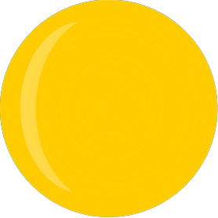

<h1 align="center">
   
  </a>
   
    Météo Matin
   
</h1>

<h4 align="center">Recevez votre météo personnalisée quotidiennement!</h4>

J'ai initiallement réalisé ce project pour m'entraîner au design et au code, mais il sera entièrement fontionnel dans un futur proche.

## Site web
Vous pouvez voir le site web à l'adresse suivante: https://damienrifflart.github.io/MeteoMatin/

## Réalisé avec:
- [Vite](https://vitejs.dev/)
- [React](https://react.dev/)
- [Typescript](https://www.typescriptlang.org/)
- [Figma](https://figma.com/)
  
## Mes autres projets
- [Shapy](https://github.com/damienRifflart/Shapy) - Une application iOs pour le sport.
- [StudyStats](https://github.com/damienRifflart/StudyStats) - Récupère automatiquement le nombre d'heures et de cours pour les 100 prochains jours.

## Contact

> Gmail: [rifflartdamiencontact@gmail.com](rifflartdamiencontact@gmail.com) &nbsp;&middot;&nbsp;
> GitHub: [@damienRifflart](https://github.com/damienRifflart) &nbsp;&middot;&nbsp;

